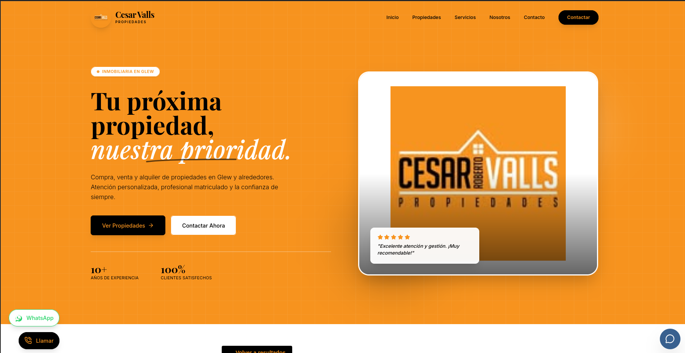

<div align="center">
   
</div>

# Cesar Valls Propiedades – Inmobiliaria en Glew

Bienvenido al repositorio de **Cesar Valls Propiedades**, una web para la gestión y publicación de propiedades en Glew y zonas cercanas.

## 🚀 Descripción

Cesar Valls Propiedades ofrece servicios integrales de compra, venta y alquiler en Glew y zona. Atención personalizada por profesional matriculado y enfoque orientado a resultados.

## 🖥️ Vista previa

<div align="center">
   
</div>

## ⚙️ Instalación y uso local

**Requisitos:** Node.js

1. Instala las dependencias:
   ```bash
   npm install
   ```
2. Si usas la integración con Gemini, crea un archivo `.env.local` y agrega tu clave:
   ```env
   GEMINI_API_KEY=tu_clave_aqui
   ```
3. Inicia la aplicación en modo desarrollo:
   ```bash
   npm run dev
   ```

---

© 2025 Cesar Valls Propiedades | Desarrollado por @dgimenezdeveloper | Todos los derechos reservados
